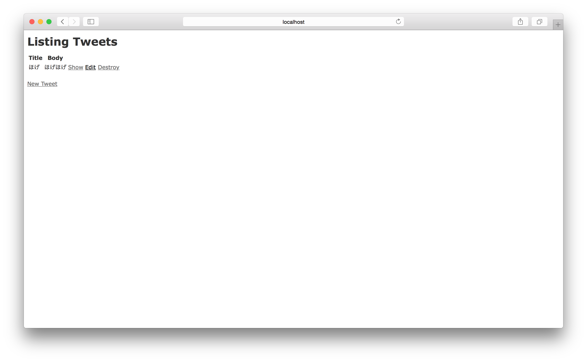
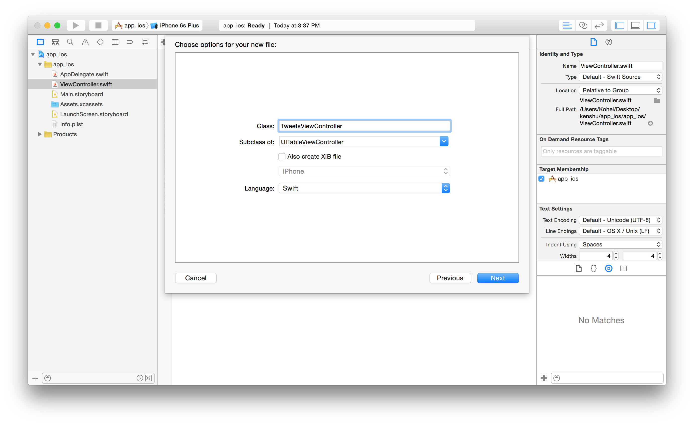
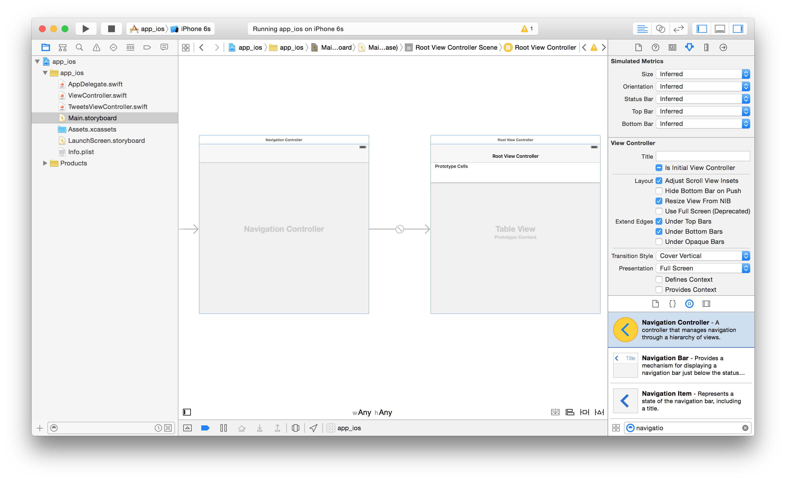
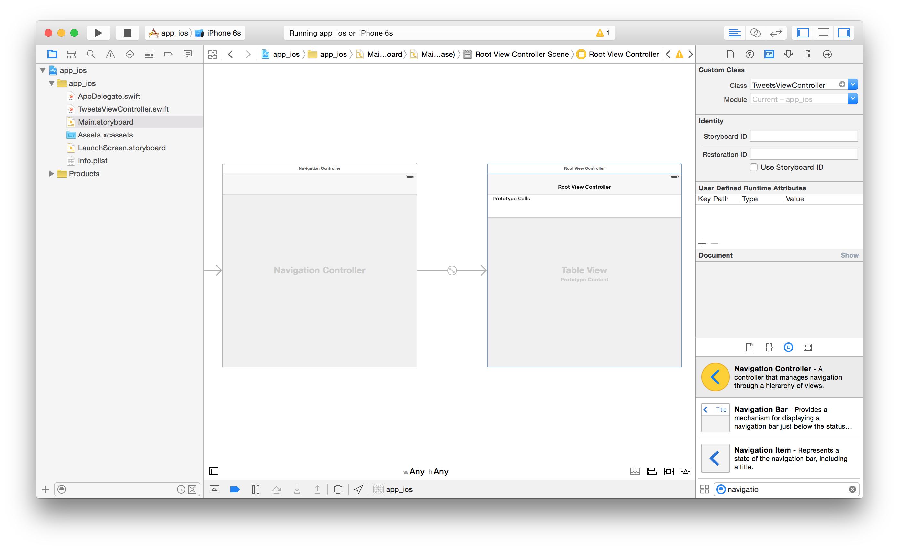
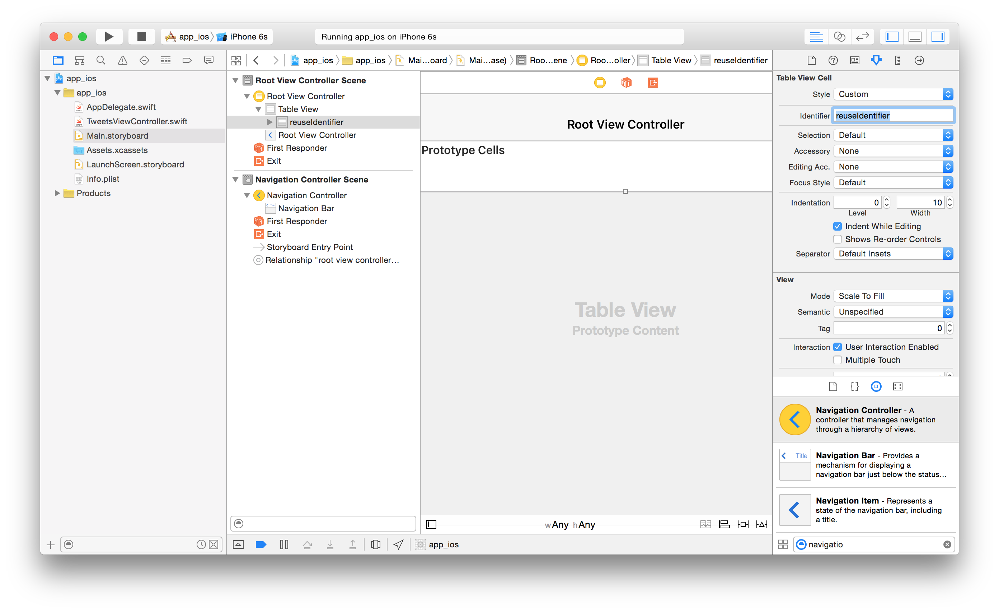
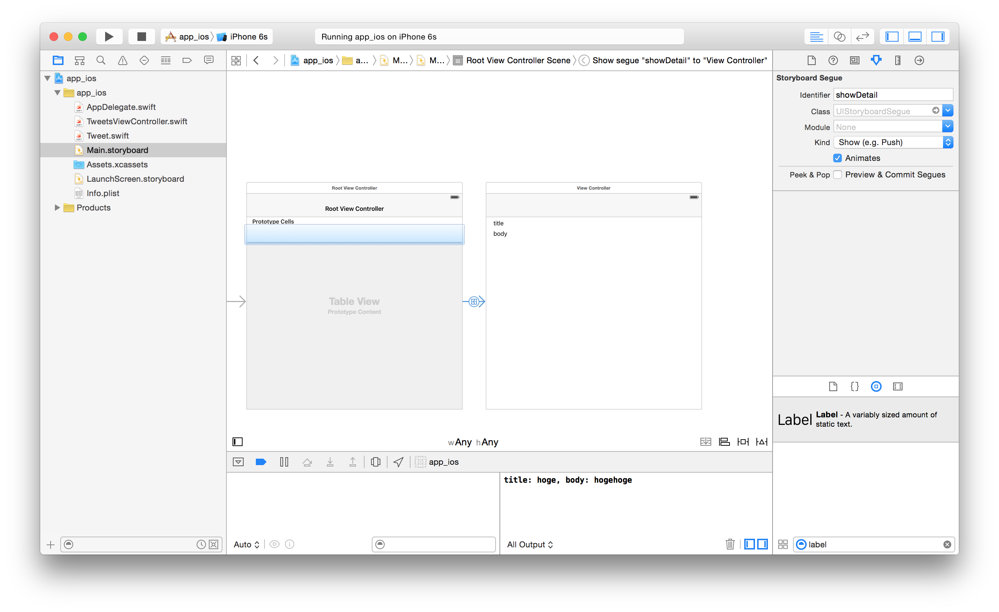
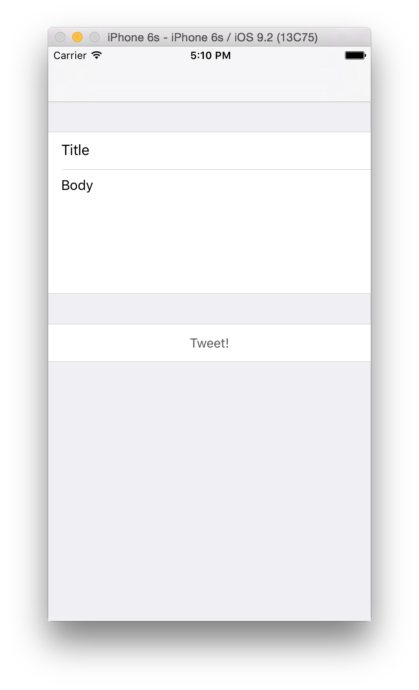
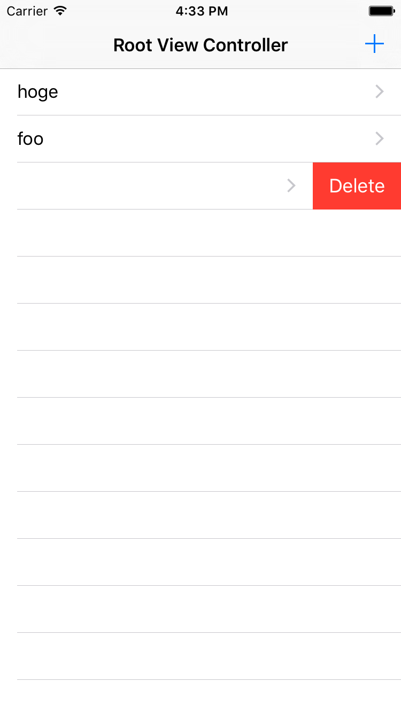
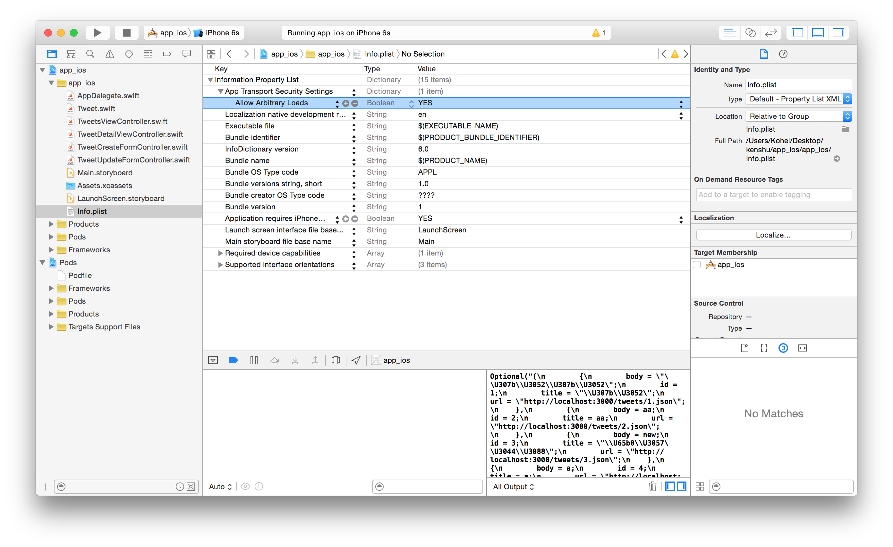

# RailsでAPIを作ってiOSから叩くチュートリアル
RailsとiOSを連携してシンプルなWebアプリケーションを開発するためのチュートリアルです。  
今回は題材として文を投稿していけるアプリ(Twitterみたいなもの)を開発していきます。  
iOSはSwiftで実装します。

### 流れ
1. [RailsのScaffoldで雛形を作る](#section1)
2. [iOSで見た目の部分を実装する](#section2)
3. [RailsでAPIを実装する](#section3)
4. [iOSで実装したAPIを利用する](#section4)

### できるようになること
* Scaffoldでシンプルなアプリが作れる
* RailsでAPIを作れる
* iOSでTwitterクライアントのようなものが作れる
* iOSでAPIを利用(HTTP通信周りの実装)ができる
* iOSのライブラリ管理ツールであるCocoaPodsが使える

### 前提条件
* Railsの入門書程度の知識とスキル
* iOSの入門書程度の知識とスキル

<a id="section1"></a>
## 1. RailsのScaffoldで雛形を作る
まずはプロジェクトを作成してScaffoldでさくっとTwitterを作りましょう。

bundlerを用いて開発を進めます。

```
$ gem install bundler
```

ディレクトリの作成とGemfileの生成

```
$ mkdir app_rails
$ cd app_rails
$ bundle init
```

Gemfileに追記

```Gemfile
# A sample Gemfile
source "https://rubygems.org"

gem "rails"
```

railsのインストールとプロジェクトの初期化

```
$ bundle install --path vendor/bundle
$ bundle exec rails new .
```

ScaffoldでModel, View, Controllerの作成（タイトルもあるツイートということで、、）

```
$ bundle exec rails g scaffold tweet title:string body:text
```

テーブル定義更新

```
$ bundle exec rake db:migrate
```

Railsサーバ起動

```
$ bundle exec rails s
```

ここまででrails側の雛形が完成です。TweetをCRUDできるwebアプリができました。



<a id="section2"></a>
## 2. iOSで見た目の部分を実装する
次にiOS側でTweetをCRUDできる画面を作っていきます。

まずはXcodeを開いて"Create a new Xcode project"を選択します。  
プロジェクトの種類は"Single View Application"を選択します。  
言語は"Swift"で実装します。  

### Tweet一覧をTableViewに表示する
まずTweetsViewControllerを作成（はじめからあるViewControllerは削除してしまっても良いです）。


StoryboardでNavigation Controllerを配置（はじめからあるViewControllerは削除してしまってもいいです）。  
追加したNavigation ControllerのIs Initial View Controllerにチェックを入れる。


Table ViewのCustom Classに上で作成したTweetsViewControllerを指定。


Table ViewのCellのidを指定。  
ここでは"reuseIdentifier"としました。


次にTweetのモデルを作成します。  
新たにTweet.swiftファイルを追加し以下のように実装します。  
デバッグしやすくするためにCustomStringConvertibleプロトコルに準拠しました。  

```Swift:Tweet.swift
import UIKit

class Tweet: CustomStringConvertible {

    let title: String
    let body: String
    
    var description: String {
        return "title: \(self.title), body: \(self.body)"
    }
    
    init(title: String, body: String) {
        self.title = title
        self.body = body
    }
}
```

Tweetモデルが実装できたので次はTweetsViewControllerを実装していきます。
はじめにダミーデータを用意します。

```Swift:TweetsViewController.swift
...
class TweetsViewController: UITableViewController {

	// ダミーデータ
    private var tweets:[Tweet] = [Tweet(title: "hoge", body: "hogehoge"),
                                  Tweet(title: "foo", body: "fooooo"),
                                  Tweet(title: "bar", body: "barbar")]
    
    override func viewDidLoad() {
...
```

次にTableView周りを実装します。

```Swift:TweetsViewController.swift
	override func numberOfSectionsInTableView(tableView: UITableView) -> Int {
        return 1
    }

    override func tableView(tableView: UITableView, numberOfRowsInSection section: Int) -> Int {
        return tweets.count
    }

    override func tableView(tableView: UITableView, cellForRowAtIndexPath indexPath: NSIndexPath) -> UITableViewCell {
        let cell = tableView.dequeueReusableCellWithIdentifier("reuseIdentifier", forIndexPath: indexPath)

        let tweet = tweets[indexPath.row]
        cell.textLabel?.text = tweet.title

        return cell
    }
```
これで起動するとTableViewにダミーデータのtitleが表示されているかと思います。

### Tweetの詳細情報を表示する
次にtitleをタップした時に遷移するDetail Viewを作成します。  
StoryboardでView(Detail View)を配置します。  
TweetsのTableViewから今作成したDetail Viewへ遷移するためのSegueを設定します。  
ここでは作成したSegueのIdentifierをshowDetail，種類をPushとします。  
titleとbodyを表示するためのLabelも配置しておきます(constraintsの設定も忘れずに)。


Storyboardで配置したDetail ViewのためのViewControllerのファイルを新しくTweetDetailViewController.swiftとして作成します。  
Detail ViewのCustom ClassにTweetDetailViewControllerを指定します。  
作成したTweetDetailViewControllerを以下のように実装します。  
配置した部品(Label)はoutletで接続しておきます。

```Swift:TweetDetailViewController.swift
import UIKit

class TweetDetailViewController: UIViewController {

    var tweet: Tweet?
    
    @IBOutlet weak var titleTextLabel: UILabel!
    @IBOutlet weak var bodyTextLabel: UILabel!
    
    override func viewDidLoad() {
        super.viewDidLoad()
        
        if let tweet = self.tweet {
            titleTextLabel.text = tweet.title
            bodyTextLabel.text = tweet.body
        }
    }
```

Detail ViewができたのでTableViewでタップした時に遷移する動作を実装します。  
TweetsViewControllerのprepareForSegueを以下のように実装する。

```Swift:TweetsViewController.swift
    override func prepareForSegue(segue: UIStoryboardSegue, sender: AnyObject?) {
        if segue.identifier == "showDetail" {
            if let indexPath = self.tableView.indexPathForSelectedRow {
                let tweet = tweets[indexPath.row]
                let controller = segue.destinationViewController as! TweetDetailViewController
                controller.tweet = tweet
                controller.navigationItem.leftBarButtonItem = self.splitViewController?.displayModeButtonItem()
                controller.navigationItem.leftItemsSupplementBackButton = true
            }
        }
    }
```
ここまででDetail Viewの実装が終わりです。  
TableViewに羅列されたtweetのtitleをタップするとtweetのDetail Viewが見れます。

### Tweetを投稿する
次に新しくtweetを投稿するビューを作ります。  
ここで投稿フォームが必要になるわけですが一から作るのは面倒なのでライブラリを使ってみましょう。  
まずはiOSのライブラリ管理ツールである[CocoaPods](https://cocoapods.org)をインストールします。

```
$ gem install cocoapods
```

XcodeプロジェクトのディレクトリでCocoapodsを利用するために初期化します。

```
$ ls
app_ios           app_ios.xcodeproj
$ pod init
```

初期化するとPodfileが作成されるので以下のように編集します。  
今回は[KHAForm](https://github.com/KoheiHayakawa/KHAForm)というライブラリを利用します。

```Podfile
platform :ios, '8.0'
use_frameworks!

target 'app_ios' do

pod 'KHAForm'
  
end
```

Podfileを編集したら以下のコマンドでライブラリをインストールします。  
インストールが終わるとapp_ios.xcworkspaceというファイルが作成されているので今のプロジェクトを一旦閉じてapp_ios.xcworkspaceからプロジェクトを開いてください。

```
$ pod install
$ ls
Podfile             Pods                app_ios.xcodeproj
Podfile.lock        app_ios             app_ios.xcworkspace <- こっちを起動
```

app_ios.xcworkspaceを起動したら[KHAFormのREADME](https://github.com/KoheiHayakawa/KHAForm/blob/master/README.md)を参考にTweetCreateFormController.swiftを新たに実装します。

```Swift:TweetCreateFormController.swift
import UIKit
import KHAForm // ライブラリをインポート

class TweetCreateFormController: KHAFormViewController {
    
    override func formCellsInForm(form: KHAFormViewController) -> [[KHAFormCell]] {
        
        let cell1 = KHAFormCell.formCellWithType(.TextField) // titleを入力するTextField
        let cell2 = KHAFormCell.formCellWithType(.TextView)  // bodyを入力するTextView
        let cell3 = KHAFormCell.formCellWithType(.Button)    // 投稿ボタン
        
        cell3.button.setTitle("Tweet!", forState: .Normal)
        cell3.button.setTitleColor(UIColor.darkGrayColor(), forState: .Normal)
        cell3.button.addTarget(self, action: Selector("didPressedTweetButton:"), forControlEvents: UIControlEvents.TouchUpInside)

        return [[cell1, cell2], [cell3]]
    }
    
    func didPressedTweetButton(sender: UIButton) {
		print("tweet!")

	    // あとでサーバに新規投稿する処理を書きます

	    dismissViewControllerAnimated(true, completion: nil)
    }
}
```

新規投稿フォームを実装できたらフォームを表示する処理を書きます。  
TweetsViewController.swiftでNavigation Barにボタンを追加してボタンをタッチした時にフォームを表示します。

```Swift:TweetsViewController
override func viewDidLoad() {
        super.viewDidLoad()

        // Navigation Barに新規投稿ボタンを追加
        let newTweetButton = UIBarButtonItem(barButtonSystemItem: .Add, target: self, action: "didTouchNewTweetBarButton:")
        navigationItem.rightBarButtonItem = newTweetButton
        
        let tweet = Tweet(title: "hoge", body: "hogehoge")
        print(tweet)
    }

	// 新規投稿ボタンが押された時にフォームを表示
    func didTouchNewTweetBarButton(sender: UIBarButtonItem) {
        let tweetCreateForm = TweetCreateFormController()
        let navigationController = UINavigationController(rootViewController: tweetCreateForm)
        presentViewController(navigationController, animated: true, completion: nil)
    }

```

ここまでで新しいtweetを投稿する時のフォームの実装が完了です。  
本当はキャンセルボタンなども実装した方がいいですがここでは割愛します。  


### Tweetを更新する
次に既存のTweetを更新するためのフォームを実装します。  
基本的には新規投稿フォームと同じですが更新するTweetの情報を保持するプロパティが追加されます。

新規投稿フォームの時と同じ要領でTweetUpdateFormController.swiftを実装します。

```Swift:TweetUpdateFormController.swift
import UIKit
import KHAForm

class TweetUpdateFormController: KHAFormViewController {
    
    var tweet: Tweet?
    
    // MARK: - View lifecycle
    
    override func viewDidLoad() {
        super.viewDidLoad()
    }
    
    override func didReceiveMemoryWarning() {
        super.didReceiveMemoryWarning()
        // Dispose of any resources that can be recreated.
    }


    // MARK: - KHAForm data source
    
    override func formCellsInForm(form: KHAFormViewController) -> [[KHAFormCell]] {
        
        let cell1 = dequeueReusableFormCellWithType(.TextField)
        let cell2 = dequeueReusableFormCellWithType(.TextView)
        let cell3 = dequeueReusableFormCellWithType(.Button)
        
        cell1.textField.text = tweet?.title
        cell2.textView.text = tweet?.body
        
        cell3.button.setTitle("Done", forState: .Normal)
        cell3.button.setTitleColor(UIColor.darkGrayColor(), forState: .Normal)
        cell3.button.addTarget(self, action: Selector("didTouchDoneButton:"), forControlEvents: UIControlEvents.TouchUpInside)
        
        return [[cell1, cell2], [cell3]]
    }
    
    
    // MARK: - Bar button action selector
    
    func didTouchDoneButton(sender: UIBarButtonItem) {
        print("edit")

	    // 後でサーバのTweetを更新する処理を書きます

        dismissViewControllerAnimated(true, completion: nil)
    }
    
}
```

編集フォームが実装できたのでDetail Viewからこのフォームを表示できるようにします。  
TweetDetailViewController.swiftでNavigation Barにボタンを追加してボタンをタッチした時にフォームを表示します。

```Swift:TweetDetailViewController.swift
override func viewDidLoad() {
        super.viewDidLoad()
        // Do any additional setup after loading the view.
        
        if let tweet = self.tweet {
            titleTextLabel.text = tweet.title
            bodyTextLabel.text = tweet.body
        }

	    // Navigation BarにEditボタンを追加
        let editButton = UIBarButtonItem(barButtonSystemItem: .Edit, target: self, action: "didTouchEditBarButton:")
        navigationItem.rightBarButtonItem = editButton
    }
    
    // MARK: - Bar button action selector

	// Editボタンが押された時に編集フォームを表示
    func didTouchEditBarButton(sender: UIBarButtonItem) {
        let tweetUpdateForm = TweetUpdateFormController()
        editTweetForm.tweet = self.tweet
        let navigationController = UINavigationController(rootViewController: tweetUpdateForm)
        presentViewController(navigationController, animated: true, completion: nil)
    }
```

ここまでで既存のTweetを更新するためのフォームの実装ができました。  
Detail Viewに戻った時に更新が反映される処理やキャンセルボタンなどを実装した方が良いですがここでは割愛します。

### Tweetを削除する
次にTweetを削除する処理を実装します。  
TweetsViewControllerに以下のメソッドを実装することでtableviewでセルをスワイプしたときにそのセルを削除することができるようになります。

```Swift:TweetsViewController.swift
    // Override to support editing the table view.
    override func tableView(tableView: UITableView, commitEditingStyle editingStyle: UITableViewCellEditingStyle, forRowAtIndexPath indexPath: NSIndexPath) {
        if editingStyle == .Delete {
            // Delete the row from the data source

	        // 後でサーバのtweetを削除する処理を書きます

            self.tweets.removeAtIndex(indexPath.row)
            tableView.deleteRowsAtIndexPaths([indexPath], withRowAnimation: .Fade)
        } 
    }
```



以上でiOSアプリ側の見た目の部分を実装することができました。  
色々と省略いている機能もあると思いますがひとまず最低限の機能は実装できたと思います。

<a id="section3"></a>
## 3. RailsでAPIを実装する
APIを実装すると書きましたが実はscaffoldした時点ですでにAPIのようなものが実装できています。  
例えばhttp://localhost:3000/tweets.jsonにアクセスすればjson形式でtweet一覧が取得できます。  
本当はAPI用のcontrollerを作成してルーティンングも分けてしっかり作るべきですがここでは話を早くするためにscaffoldで作られたAPIを使って実装を進めます。

ただしこれをAPIとして使うには1つだけ準備が必要です。
RailsではCSRF対策が有効になっているためPOSTなどをする際はHTTPリクエストにトークンの値を入れなければいけません。  
iOSからリクエストする際はこれが結構面倒なのでRailsのCSRFを無効にしてしまします。  
セキュリティ的には好ましくないですが今回は簡単のためです。  
実装は以下のようにprotect_from_forgery with: :null_sessionと一行追加するだけです。

```Ruby:tweets_controller.rb
class TweetsController < ApplicationController
  before_action :set_tweet, only: [:show, :edit, :update, :destroy]
  protect_from_forgery with: :null_session // ここを追加

  # GET /tweets
  # GET /tweets.json
  def index
    @tweets = Tweet.all
  end
```

<a id="section4"></a>
## 4. iOSで実装したAPIを利用する

### 準備
まず便利なライブラリを3つ追加します。  
[Alamofire](https://github.com/Alamofire/Alamofire): HTTP通信周りが簡単にできる  
[SwiftyJSON](https://github.com/SwiftyJSON/SwiftyJSON): JSONデータを扱いやすくしてくれる(APIで取得したデータをjsonオブジェクトに変換できる)  
[ObjectMapper](https://github.com/Hearst-DD/ObjectMapper): jsonデータをモデルへ簡単にマッピングできる  

Podfileに3つのライブラリを追記してinstallします。  

```Podfile
platform :ios, '8.0'
use_frameworks!

target 'app_ios' do

pod 'KHAForm'
pod 'Alamofire'
pod 'SwiftyJSON'
pod 'ObjectMapper'

end
```

```
$ pod install
```

もう一つ準備が必要です。  
iOS9より実装された、ATS(App Transport Security)という機能により、HTTPによるアクセスが制限されてしまいます(HTTPSはOKで、公式ではHTTPSに統一するようにとの記述があります)。  
そこで今回はチュートリアルということで話を簡単に進めるためATS機能をOFFにしてしまします。  
下のスクリーンショットのようにInfo.plistにApp Transport Security Settingsという項目を追加します。  
さらにその中にAllow Arbitrary Loadsという項目を追加し、この値をYESにしておきます。  
これで制限なくHTTP通信できます。




### サーバからTweet一覧を取得してTableViewに表示する
準備が終わり、実装に移ります。  
まずはTweetモデルから実装していきます。  
installしたライブラリをimportします。  
ObjectMapperのプロトコルであるMappableに準拠します。  
プロパティは変数に変更してoptionalにします(この辺がObjectMapperのデメリットですね)。  
同時にidプロパティを追加します。  
init?とmappingのメソッドをREADMEを参考に実装します。

ここまできたらいよいよサーバとの通信を実装します。  
getTweetsをクラスメソッドとして以下のように実装します。  
まずAlamofireを用いてtweet一覧を取得するAPIにアクセスします。  
ハンドラで取得したデータの処理を行います。  
なんらかのエラーがある場合はコールバックとしてエラーの内容を引数を引数にもつfailureを実行します。  
エラーがない場合はまず取得したデータをSwiftyJSONを用いてjsonオブジェクトに変換します。  
そしてmapを用いてすべてのjsonオブジェクト形式のtweetをモデルへ変換し，tweetsへ格納します。

以下のような実装になります。  
nilチェックなど甘いところもありますがひとまずこれでtweet一覧を取得するメソッドは完成とします。

```Swift:Tweet.swift
import UIKit
import ObjectMapper
import Alamofire
import SwiftyJSON

class Tweet: Mappable, CustomStringConvertible {

	var id: Int?
    var title: String?
    var body: String?
    
    var description: String {
        return "title: \(self.title), body: \(self.body)"
    }
    
    init(title: String, body: String) {
        self.title = title
        self.body = body
    }
    
    required init?(_ map: Map) {

    }
    
    func mapping(map: Map) {
		id    <- map["id"]
        title <- map["title"]
        body  <- map["body"]
    }
    
    class func getTweets(success success: [Tweet] -> Void, failure: NSError? -> Void) {
        Alamofire.request(.GET, "http://localhost:3000/tweets.json").responseJSON { response in
            if let error = response.result.error {
                failure(error)
                return
            }
            let json = JSON(response.result.value!)
            let tweets: [Tweet] = json.arrayValue.map{tweetJson -> Tweet in
                return Mapper<Tweet>().map(tweetJson.dictionaryObject!)!
            }
            success(tweets)
            return
        }
    }
}
```

実装したgetTweetsメソッドを使って実際にサーバからTweetを取得して表示します。  
TweetsViewControllerに以下を追記します。  
ここではviewWillAppearのタイミングでデータを取得&表示しています。

```Swift:TweetsViewController.swift
    override func viewWillAppear(animated: Bool) {
        refreshData()
    }
    
    func refreshData() {
        Tweet.getTweets(
            success: {(tweets) -> Void in
                self.tweets = tweets.reverse()
                self.tableView.reloadData()
            },
            failure: {(error) -> Void in
                // エラー処理
			    let alertController = UIAlertController(
                    title: "エラー",
                    message: "エラーメッセージ",
                    preferredStyle: .Alert)
                alertController.addAction(UIAlertAction(
                    title: "OK",
                    style: .Default,
                    handler: nil))
                self.presentViewController(alertController, animated: true, completion: nil)
        })
    }
```

アプリでよくある「引っ張って更新」も実装しておきます。  
同様にTweetsViewControllerに以下を実装します。  
まずviewDidLoad内にrefreshControlを初期化するコードとアクション(onRefresh)を追加するコードをに行加えます。そしてアクションを実装します。  
refreshControlは自分で回り始めと終わりを記述しないといけないため少し冗長なコードになってしまします。

```Swift:TweetsViewController.swift
    override func viewDidLoad() {
        super.viewDidLoad()

        // Navigation Barに新規投稿ボタンを追加
        let newTweetButton = UIBarButtonItem(barButtonSystemItem: .Add, target: self, action: "didTouchNewTweetBarButton:")
        navigationItem.rightBarButtonItem = newTweetButton
        
        refreshControl = UIRefreshControl()
        refreshControl?.addTarget(self, action: Selector("onRefresh:"), forControlEvents: UIControlEvents.ValueChanged)
    }
    
    func onRefresh(sender: UIRefreshControl) {
        refreshControl?.beginRefreshing()
        Tweet.getTweets(
            success: {(tweets) -> Void in
                self.tweets = tweets.reverse()
                self.tableView.reloadData()
                self.refreshControl?.endRefreshing()
            },
            failure: {(error) -> Void in
                // エラー処理
                let alertController = UIAlertController(
                    title: "エラー",
                    message: "エラーメッセージ",
                    preferredStyle: .Alert)
                alertController.addAction(UIAlertAction(
                    title: "OK",
                    style: .Default,
                    handler: nil))
                self.presentViewController(alertController, animated: true, completion: nil)
                self.refreshControl?.endRefreshing()
        })
    }

```

### サーバへTweetを新規投稿する
新規投稿フォームで入力した情報をサーバへPOSTします。  
まずはtweetモデルに以下のようにcreateTweetメソッドを実装します。  
tweet一覧取得のGETとは違って，パラメータを付与しなければいけないためその処理が追加されています。  
返り値を利用することがないためハンドラの処理はシンプルです。

```Swift:Tweet.swift
    func createTweet(success success: Void -> Void, failure: NSError? -> Void) {
        
        let params: [String: AnyObject] = [
            "title" : self.title!,
            "body"  : self.body!
        ]
        
        let request = NSMutableURLRequest(URL: NSURL(string: "http://localhost:3000/tweets.json")!)
        request.HTTPMethod = "POST"
        let alamofireRequest = Alamofire.ParameterEncoding.JSON.encode(request, parameters: params).0
        
        Alamofire.request(alamofireRequest).responseJSON { response in
            if let error = response.result.error {
                failure(error)
                return
            }
            success()
            return
        }
    }
```

次にTweetCreateFormController.swiftでTweetボタンが押されたときに上で実装したメソッドを使ってPOSTします。  
testFieldのtitleとtextViewのbodyからtweetを初期化し，createTweetを呼び出すことでPOSTします。

```Swift:TweetCreateFormController.swift
    func didPressedTweetButton(sender: UIButton) {
        
        let cell1 = formCellForIndexPath(NSIndexPath(forRow: 0, inSection: 0))
        let cell2 = formCellForIndexPath(NSIndexPath(forRow: 1, inSection: 0))
        
        let tweet = Tweet(title: cell1.textField.text!, body: cell2.textView.text)
        tweet.createTweet(
            success: {
                print("success create")
            },
            failure: {(error) in
                print("fail create")
            }
        )
        dismissViewControllerAnimated(true, completion: nil)
    }
```

### サーバのTweetを更新する
既存のTweetの編集フォームから変更をサーバに反映させます。  
まずはtweetモデルに以下のようにupdateTweetを実装します。  
createとほぼ同じですが，リクエストのURLに変化があります。  
更新は1つのtweetに対して行うので，クエリにtweetのidを入れています。

```Swift:Tweet.swift
    func updateTweet(success success: Void -> Void, failure: NSError? -> Void) {
        
        let params: [String: AnyObject] = [
            "title" : self.title!,
            "body"  : self.body!
        ]
        
        let request = NSMutableURLRequest(URL: NSURL(string: "http://localhost:3000/tweets/\(self.id!).json")!)
        request.HTTPMethod = "PATCH"
        let alamofireRequest = Alamofire.ParameterEncoding.JSON.encode(request, parameters: params).0
        
        Alamofire.request(alamofireRequest).responseJSON { response in
            if let error = response.result.error {
                failure(error)
                return
            }
            success()
            return
        }
    }
```

上で実装したupdateTweetを実際にTweetUpdateFormControllerから利用します。  
TweetUpdateFormControllerではすでにtweetモデルがプロパティとして存在しているのでtitleとbodyを入力された情報に書き換えてメソッドを実行します。

```Swift:TweetUpdateFormController.swift
    func didTouchDoneButton(sender: UIBarButtonItem) {

        let cell1 = formCellForIndexPath(NSIndexPath(forRow: 0, inSection: 0))
        let cell2 = formCellForIndexPath(NSIndexPath(forRow: 1, inSection: 0))
        
        tweet?.title = cell1.textField.text
        tweet?.body = cell2.textView.text
        
        tweet?.updateTweet(
            success: {
                print("success update")
            },
            failure: {error in
                print("fail update")
            }
        )
        
        dismissViewControllerAnimated(true, completion: nil)
    }
```

### サーバのTweetを削除する
TableViewからTweetを削除する処理を実装します。  
まずはtweetモデルに以下のようにdeleteTweetメソッドを実装します。  
パラメータはないので削除するtweetのidをクエリにします。

```Swift:Tweet.swift
    func deleteTweet(success success: Void -> Void, failure: NSError? -> Void) {

        Alamofire.request(.DELETE, "http://localhost:3000/tweets/\(self.id!).json").responseJSON { response in
            if let error = response.result.error {
                failure(error)
                return
            }
            success()
            return
        }
    }
```

TableViewでDeleteボタンが押されたときの処理を実装します。  
削除が成功した場合のみ，tweets配列とtableViewから削除されたtweetを取り除きます。

```Swift:TweetsViewController.swift
    override func tableView(tableView: UITableView, commitEditingStyle editingStyle: UITableViewCellEditingStyle, forRowAtIndexPath indexPath: NSIndexPath) {
        if editingStyle == .Delete {
            // Delete the row from the data source
            
            let tweet = self.tweets[indexPath.row]
            tweet.deleteTweet(
                success: {
                    print("success delete")
                    self.tweets.removeAtIndex(indexPath.row)
                    tableView.deleteRowsAtIndexPaths([indexPath], withRowAnimation: .Fade)
                },
                failure: {(error) in
                    print(error)
                    print("fail delete")
                }
            )
        } 
    }
```

## おわりに
これで基本的な機能がすべて完成しました。  
ここまでできればiOSとRailsを連携して簡単なアプリケーションが作れると思います。

nilチェックやエラー処理などバグの原因になりやすいところの多くを省略してしまったので自分でアプリを作るときはしっかり対策していってください。  
HTTPリクエスト周りもコードをもう少しキレイにできたりします。  
また，話を簡単にするためにCSRFを無効にしたりATS機能をOFFにしたりしましたがセキュリティ的には好ましくないのでサービスとしてリリースするときはしっかり対策してください。

最後にサンプルコードはrailsとiOSそれぞれapp_railsとapp_iosにあります。

もっとちゃんとしたコードが見たい方はこちらが参考になると思います。  
今回省略してしまったことをなるべく省略せずにやってます。  
ユーザ管理も実装してますし，コードもキレイだと思います。  
Rails: [https://github.com/KoheiHayakawa/HTTP_Networking_sample_rails](https://github.com/KoheiHayakawa/HTTP_Networking_sample_rails)  
iOS: [https://github.com/KoheiHayakawa/HTTP_Networking_sample_swift](https://github.com/KoheiHayakawa/HTTP_Networking_sample_swift)
